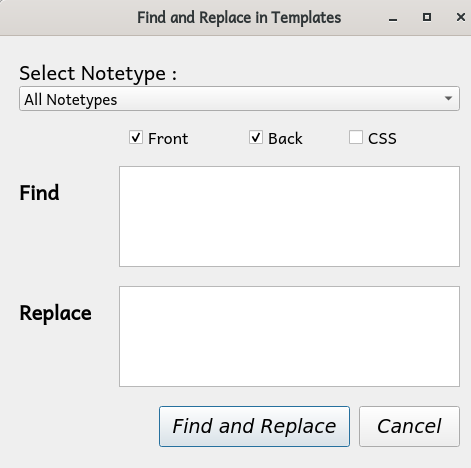

# Find and Replace in Card Templates

**An Addon for [Anki version 2.1](https://apps.ankiweb.net/)**

Find and Replace in Card Templates is a powerful addon designed for Anki version 2.1. It offers the option to find and replace strings in card templates, whether individually or in bulk. This functionality proves to be invaluable when developing addons or creating intricate card templates.

## Requirements
- Supports Anki versions >= v2.1.20 and <= 2.1.65

## Usage
1. Adds an item **Find and Replace in Templates** to the 'Edit' menu in the Browser.
2. Choose the Notetype in which you wish to find and replace strings within templates.

## Screenshots

To download and install the addon, please [visit AnkiWeb](https://ankiweb.net/shared/info/992153575).

---

## Compatibility
Works with Anki versions >= v2.1.20.

## Author
**Venkata Ramana P**
- [GitHub](https://github.com/itsmepvr)

---

## Copyright and License
Copyright 2019 Itsmepvr under [The GNU GPL License (GNU)](LICENSE).
